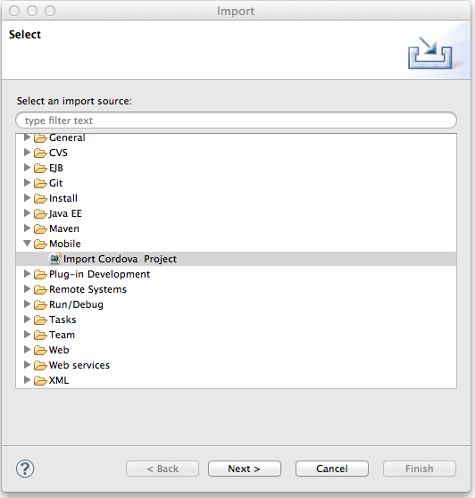

helloworld-push-cordova: Basic Mobile Application showing the AeroGear Push feature 
===================================================================================
Author: Erik Jan de Wit (edewit)
Level: Beginner  
Technologies: JavaScript cordova
Summary: A basic example of Push : Registration and receiving messages.  
Target Product: Mobile  
Product Versions: EAP 6.1, EAP 6.2, EAP 6.3  
Source: https://github.com/aerogear/aerogear-push-helloworld/cordova

What is it?
-----------

This project is a very simple helloworld, to show how to get started with cordova and the UnifiedPush Server

System requirements
-------------------

What is needed for Android / iOS / Cordova : think of Cordova version / xcode version / Android SDK version needed

install cordova
```
npm install -g cordova
```

Configure Cordova
-----------------

If you have not yet done so, you must [Configure Maven](../README.md#configure-maven) before testing the quickstarts.

Build and Deploy the HelloWorld
-------------------------------

## Change Push Configuration

In www/js/index.js find the pushConfig and change the server url to your openshift instance alias and variant/secret:

```javascript
var pushConfig = {
   pushServerURL: "<pushServerURL e.g http(s)//host:port/context >",
   alias: "<alias e.g. a username or an email address optional>",
   android: {
      senderID: "<senderID e.g Google Project ID only for android>",
      variantID: "<variantID e.g. 1234456-234320>",
      variantSecret: "<variantSecret e.g. 1234456-234320>"
   },
   ios: {
      variantID: "<variantID e.g. 1234456-234320>",
      variantSecret: "<variantSecret e.g. 1234456-234320>"
   }
};

```

You can also copy/paste these settings from your UnifiedPush console

Install platforms
```
cordova platform add ios android
```

Add the plugin
```
cordova plugin add org.jboss.aerogear.cordova.push
```

For iOS you'll need a valid provisioning profile as you will need to test on device (push notification not available on simulator)
Replace the bundleId with your bundleId (the one associated of your certificate), by editing the config.xml in the root of this project change the id attribute of the `widget` node. After that run a `cordova platform rm ios` followed by `cordova platform add ios` to change the xcode project template. 

Run the application on a device
```
cordova run <android or ios>
```

Application Flow
----------------------

## Registration

Explain quickly the registration flow + screenshot of the console where we can check in the Installation page if the device is registered 

## Sending Push Notification

* Showing the compose message feature 

* Maybe also the CURL ? 


FAQ
--------------------


Run the HelloWorld in JBoss Developer Studio or Eclipse
-------------------------------------------------------

Import the generated project into JBDS


Select the project location and project


Add the plugin


Run the project on a device


Debug the Application
=====================

Start a browser chrome for android or safari for iOS

iOS 
* Develop -> <device name> -> index.html

Android
* Menu -> Tools -> Inspect Devices -> inspect
