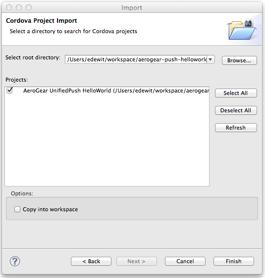
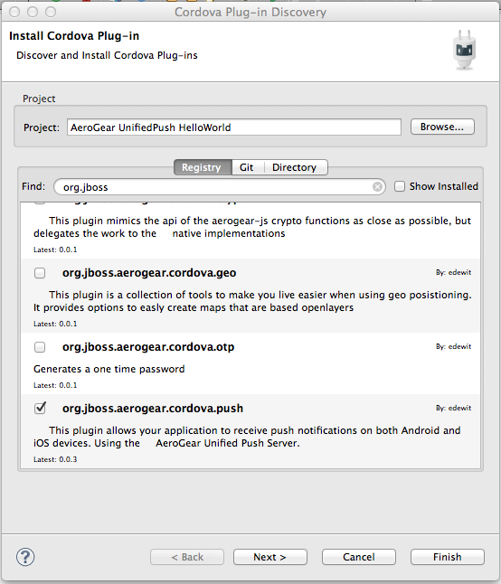
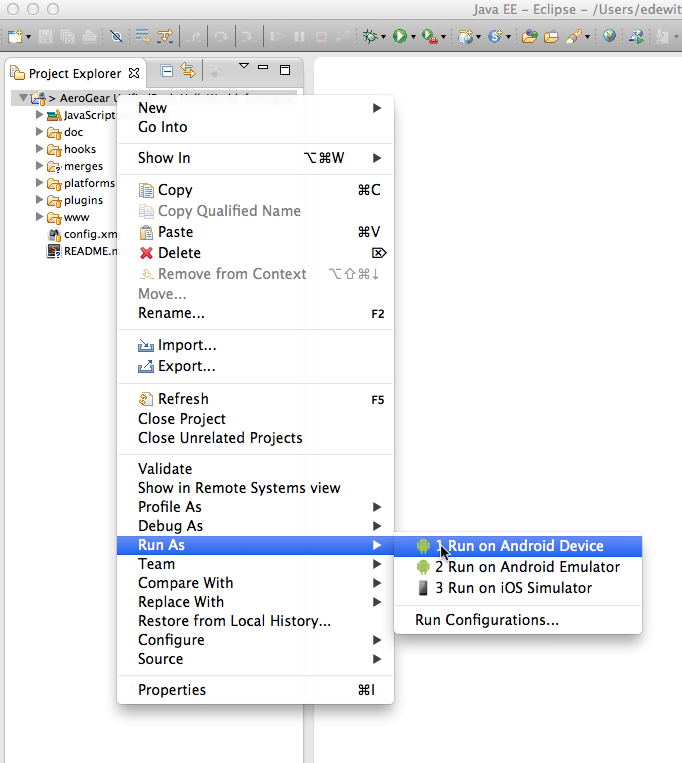

helloworld-push-Cordova: Basic Mobile Application showing the AeroGear Push feature
===================================================================================
Author: Erik Jan de Wit (edewit)
Level: Beginner
Technologies: JavaScript Cordova
Summary: A basic example of Push : Registration and receiving messages.
Target Product: Mobile
Product Versions: MP 1.0
Source: https://github.com/aerogear/aerogear-push-helloworld/cordova

What is it?
-----------

This project is a very simple hello world, to show how to get started with Cordova and the UnifiedPush Server

System requirements
-------------------

What is needed for Cordova:

The Cordova command line tooling is based on node.js so first you'll need to [install node](http://nodejs.org/download/)

then you can install Cordova by executing:
```
npm install -g Cordova
```

To deploy on iOS you need to install the ios-deploy package as well
```
npm install -g ios-deploy
```

Configure Cordova
-----------------

If you have not yet done so, you must [Configure Maven](../README.md#configure-maven) before testing the quickstarts.

Build and Deploy the HelloWorld
-------------------------------

## iOS
For iOS you'll need a valid provisioning profile as you will need to test on an actual device (push notification is not available when using a simulator)
Replace the bundleId with your bundleId (the one associated with your certificate), by editing the config.xml at the root of this project, change the id attribute of the `widget` node. After that run a `Cordova platform rm ios` followed by `cordova platform add ios` to change the Xcode project template.

If you want to change your bundleId later on, you will still have to run a `cordova platform rm ios` followed by `cordova platform add ios` to change the Xcode project template.

## Change Push Configuration

In www/js/index.js find the pushConfig and change the server url to your OpenShift instance alias and variant/secret:

```javascript
var pushConfig = {
   pushServerURL: "<pushServerURL e.g http(s)//host:port/context >",
   android: {
      senderID: "<senderID e.g Google Project ID only for android>",
      variantID: "<variantID e.g. 1234456-234320>",
      variantSecret: "<variantSecret e.g. 1234456-234320>"
   },
   ios: {
      variantID: "<variantID e.g. 1234456-234320>",
      variantSecret: "<variantSecret e.g. 1234456-234320>"
   }
};

```

You can also copy/paste these settings from your UnifiedPush console

Install platforms
```
cordova platform add ios android
```

Add the plugin
```
cordova plugin add org.jboss.aerogear.Cordova.push
```

Run the application on a device
```
cordova run <android or ios>
```

Application Flow
----------------------

## Registration
When you start the application Cordova will fire a `deviceready` event when Cordova initialization is done and the device is ready (see `www/js/index.js`). On this event the `register` function will be executed registering the device with the UnifiedPush server. The first argument is a function that gets executed when the device receives a push event, followed by a success and errorCallback that are invoked when the register was successful or not and the last parameter is the push configuration that indicates where the push server is located and which variant/secret to use. When registration is successful it will display this on the UI. You can also verify that the registration was successful by going to the console there a new instance will have appeared with your deviceId, platform and status.

## Sending message
Now you can send a message to your device using the UnifiedPush admin console.  Click on the "Send Push" icon in the navigation menu and select the application that you created and wish to send a notification to.  Write a message in the text field and hit 'Send Push Notification'.


After a while you will see the message end up on the device. In the register function we've specified a notification event handler `app.onNotification` this handler is invoked when a push notification is received and adds an item (li element) to the list.


Run the HelloWorld in JBoss Developer Studio or Eclipse
-------------------------------------------------------

Import the generated project into JBDS


Select the project location and project


Add the plugin


Run the project on a device


Debug the Application
=====================

Start a browser chrome for android or safari for iOS

iOS
* Develop -> &lt;device name> -> index.html

Android
* Menu -> Tools -> Inspect Devices -> inspect
