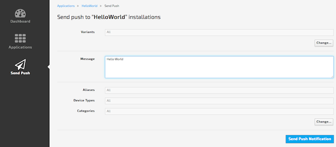

helloworld-push-ios: Basic Mobile Application showing the AeroGear Push feature on iOS
======================================================================================
Author: Corinne Krych (ckrych)  
Level: Beginner  
Technologies: Objective-C, iOS  
Summary: A basic example of Push : Registration and receiving messages.  
Target Product: Mobile  
Product Versions: EAP 6.1, EAP 6.2, EAP 6.3  
Source: https://github.com/aerogear/aerogear-push-helloworld/ios

What is it?
-----------

This project is a very simple helloworld, to show how to get started with the UnifiedPush Server on iOS.

System requirements
-------------------
- iOS 7.X
- Xcode version 5.1.X

Configure
---------
* Have created an variant in UnifiedPush admin console
* Have a valid provisioning profile as you will need to test on device (push notification not available on simulator)
* Replace the bundleId with your bundleId (the one associated with your certificate).
Go to HelloWorld target -> Info -> change Bundle Identifier field.


Open **HelloWorld.xcodeproj** and that's it.

Build and Deploy the HelloWorld
-------------------------------

### Change Push Configuration

In HelloWorld/AGAppDelegate.h find replace URL, variant and secret:

```javascript
- (void)application:(UIApplication *)application didRegisterForRemoteNotificationsWithDeviceToken:(NSData *)deviceToken {
    // initialize "Registration helper" object using the
    // base URL where the "AeroGear Unified Push Server" is running.
    AGDeviceRegistration *registration =

    // WARNING: make sure, you start JBoss with the -b 0.0.0.0 option, to bind on all interfaces
    // from the iPhone, you can NOT use localhost :)
    [[AGDeviceRegistration alloc] initWithServerURL:[NSURL URLWithString:@"<# URL of the running AeroGear UnifiedPush Server #>"]];

    [registration registerWithClientInfo:^(id<AGClientDeviceInformation> clientInfo) {
        // You need to fill the 'Variant Id' together with the 'Variant Secret'
        // both received when performing the variant registration with the server.
        [clientInfo setVariantID:@"<# Variant Id #>"];
        [clientInfo setVariantSecret:@"<# Variant Secret #>"];

        // if the deviceToken value is nil, no registration will be performed
        // and the failure callback is being invoked!
        [clientInfo setDeviceToken:deviceToken];

        // apply the token, to identify THIS device
        UIDevice *currentDevice = [UIDevice currentDevice];

        // --optional config--
        // set some 'useful' hardware information params
        [clientInfo setOperatingSystem:[currentDevice systemName]];
        [clientInfo setOsVersion:[currentDevice systemVersion]];
        [clientInfo setDeviceType: [currentDevice model]];


    } success:^() {

        // Send NSNotification for success_registered, will be handle by registered AGViewController
        NSNotification *notification = [NSNotification notificationWithName:@"success_registered" object:nil];
        [[NSNotificationCenter defaultCenter] postNotification:notification];
        NSLog(@"Unified Push registration successful");

    } failure:^(NSError *error) {

        // Send NSNotification for error_register, will be handle by registered AGViewController
        NSNotification *notification = [NSNotification notificationWithName:@"error_register" object:nil];
        [[NSNotificationCenter defaultCenter] postNotification:notification];
        NSLog(@"Unified Push registration Error: %@", error);

    }];
}

```


Application Flow
----------------------

### Registration

When the application is launched, AGAppDelegate's ```application:didFinishLaunchingWithOptions:``` registers the app to receive remote notifications. 

```javascript
- (BOOL)application:(UIApplication *)application didFinishLaunchingWithOptions:(NSDictionary *)launchOptions
{
    [[UIApplication sharedApplication] registerForRemoteNotificationTypes: 
        (UIRemoteNotificationTypeBadge |
         UIRemoteNotificationTypeSound | 
         UIRemoteNotificationTypeAlert)];    
    ...
}
```

Therefore, AGAppDelegate's ```application:didRegisterForRemoteNotificationsWithDeviceToken:``` will be called.

When AGAppDelegate's ```application:didRegisterForRemoteNotificationsWithDeviceToken:``` is called, the device is registered to UnifiedPush Server instance. This is where configuration changes are required (see code snippet below).

### Sending message
Now you can send a message to your device by clicking `Compose Message...` from the application page. Write a message in the text field and hit 'Send Push Message'. 



After a while you will see the message end up on the device. 

When the application is running in foreground, you can catch messages in AGAppDelegate's  ```application:didReceiveRemoteNotification:```. The event is forwarded using ```NSNotificationCenter``` for decoupling AGappDelegate and AGViewController. It will be the responsability of AGViewController's ```messageReceived:``` method to render the message on UITableView.

When the app is running in background, user can bring the app in the foreground by selecting the Push notification. Therefore AGAppDelegate's  ```application:didReceiveRemoteNotification:``` will be triggered and the message displayed on the list. If a background processing was needed we could have used ```application:didReceiveRemoteNotification:fetchCompletionHandler:```. Refer to [Apple documentation for more details](https://developer.apple.com/library/ios/documentation/uikit/reference/UIApplicationDelegate_Protocol/Reference/Reference.html#//apple_ref/occ/intfm/UIApplicationDelegate/application:didReceiveRemoteNotification:fetchCompletionHandler:)

For application not running, we're using AGAppDelegate's ```application:didFinishLaunchingWithOptions:```, we locally save the latest message and forward the event to AGViewController's ```messageReceived:```.

**NOTE**: The local save is required here because of the asynchronous nature of ```viewDidLoad``` vs ```application:didFinishLaunchingWithOptions:```


FAQ
--------------------

* Which iOS version is supported by AeroGear iOS libraries?

AeroGear supports iOS 7.X


Debug the Application
=====================

Set a break point in Xcode.
